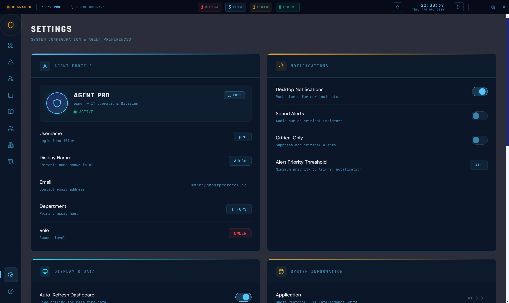

<div align="center">
  

  <h1>GHOST PROTOCOL HELPDESK</h1>
  <h3><em>Enterprise-Grade Incident Management & Help Desk System for Windows</em></h3>

  <br/>

  
  
  
  
  
  
  

  <br/><br/>
  
## ⬇️ Download

<div align="center">


<br/><br/>

<a href="https://github.com/moneraldabai-ui/ghost-protocol-helpdesk/releases/download/v1.0.0/GhostProtocol-1.0.0-Setup.exe">
  
</a>

&nbsp;&nbsp;&nbsp;

<a href="https://github.com/moneraldabai-ui/ghost-protocol-helpdesk/archive/refs/heads/main.zip">
  
</a>

<br/><br/>

| | File | Description |
|---|------|-------------|
| 🖥️ | **GhostProtocol-1.0.0-Setup.exe** | Windows installer — recommended for end users |
| 📦 | **Source Code (.zip)** | Full source — for developers |

</div>
</div>

<br/>

  <a href="#-features">Features</a> &nbsp;&bull;&nbsp;
  <a href="#-screenshots">Screenshots</a> &nbsp;&bull;&nbsp;
  <a href="#-installation">Installation</a> &nbsp;&bull;&nbsp;
  <a href="#-roles--permissions">Roles</a> &nbsp;&bull;&nbsp;
  <a href="#-building">Building</a>
---

## Why Ghost Protocol?

Managing IT incidents without the right tools leads to chaos — missed tickets, no accountability, zero visibility into operations. **Ghost Protocol** delivers a complete, offline-capable desktop command center for IT teams: from incident intake to resolution, knowledge sharing, comprehensive audit trails, and actionable analytics — all in one secure, self-contained application that runs entirely on your infrastructure.

---

## ✨ Features

<table>
  <tr>
    <td width="50%" valign="top">
      <h3>🎫 Incident Management</h3>
      <ul>
        <li>Full CRUD with role-based access control</li>
        <li>Status tracking: New, In Progress, Escalated, Resolved, Closed</li>
        <li>Priority levels: Critical, High, Medium, Low</li>
        <li>Department and assignee management</li>
        <li>Bulk actions: Assign, Priority change, Delete</li>
        <li>Smart deletion rules enforced per role</li>
      </ul>
    </td>
    <td width="50%" valign="top">
      <h3>📊 Operations Dashboard</h3>
      <ul>
        <li>Real-time incident metrics and KPIs</li>
        <li>Department load visualization chart</li>
        <li>Live activity feed with quick actions</li>
        <li>Critical incident alerts</li>
        <li>Today's resolution stats</li>
        <li>Auto-refresh polling</li>
      </ul>
    </td>
  </tr>
  <tr>
    <td width="50%" valign="top">
      <h3>📚 Knowledge Base</h3>
      <ul>
        <li>Markdown article editor with preview</li>
        <li>Category organization and filtering</li>
        <li>Full-text search across articles</li>
        <li>YES/NO feedback rating system</li>
        <li>Report an Issue functionality</li>
        <li>Real-time notifications bell</li>
      </ul>
    </td>
    <td width="50%" valign="top">
      <h3>👥 User & Department Management</h3>
      <ul>
        <li>End user (reporter) directory</li>
        <li>Ticket reassignment on user deletion</li>
        <li>Company department organization</li>
        <li>Incident reassignment protection</li>
        <li>Capacity tracking per department</li>
        <li>Active/Inactive status management</li>
      </ul>
    </td>
  </tr>
  <tr>
    <td width="50%" valign="top">
      <h3>🔒 Security & Audit</h3>
      <ul>
        <li>RBAC with 4 roles: Owner, Admin, Operator, Viewer</li>
        <li>bcrypt password hashing</li>
        <li>Session-based auth (auto-logout on close)</li>
        <li>Complete audit log with filtering</li>
        <li>User approval workflow</li>
        <li>Role hierarchy enforcement</li>
      </ul>
    </td>
    <td width="50%" valign="top">
      <h3>📈 Reports & Analytics</h3>
      <ul>
        <li>Incidents by status, priority, department</li>
        <li>Trend analysis over time</li>
        <li>Resolution rate metrics</li>
        <li>PDF report generation</li>
        <li>Excel/CSV data export</li>
        <li>Date range filtering</li>
      </ul>
    </td>
  </tr>
  <tr>
    <td width="50%" valign="top">
      <h3>💾 Backup & Restore</h3>
      <ul>
        <li>One-click database backup (Owner only)</li>
        <li>Restore from any backup point</li>
        <li>Backup history management</li>
        <li>JSON export for portability</li>
        <li>Data stored in %APPDATA%</li>
        <li>Survives app uninstall</li>
      </ul>
    </td>
    <td width="50%" valign="top">
      <h3>🎨 User Experience</h3>
      <ul>
        <li>Dark Intelligence Theater theme</li>
        <li>Cinematic splash screen with skip</li>
        <li>Smooth Framer Motion animations</li>
        <li>Custom window controls</li>
        <li>Responsive sidebar navigation</li>
        <li>Context-aware help system</li>
      </ul>
    </td>
  </tr>
</table>

---

## 📸 Screenshots

<div align="center">

### 🔐 Login Screen


</div>

<br/>

<details>
<summary>📂 <strong>View All Screenshots</strong> — click to expand</summary>

<br/>

<div align="center">

**📊 Operations Dashboard**
<br/>


<br/><br/>

**🎫 Incident Management**
<br/>

&nbsp;


<br/><br/>


&nbsp;


<br/><br/>

**📚 Knowledge Base**
<br/>


<br/><br/>

**👥 Users & Departments**
<br/>

&nbsp;


<br/><br/>


<br/><br/>

**📈 Reports & Audit**
<br/>

&nbsp;


<br/><br/>

**⚙️ Settings & Help**
<br/>

&nbsp;


</div>

</details>

---

## 🎬 Demo Video

<div align="center">

> 🎥 *Full demo video coming soon — showcasing Ghost Protocol's complete workflow from incident intake to resolution.*

<!-- VIDEO PLACEHOLDER -->
<!-- Once ready, replace this block with: -->
<!-- [](https://youtube.com/your-link) -->

</div>

---

## 🔐 Roles & Permissions

| Role | Access Level | Capabilities |
|:-----|:-------------|:-------------|
| 👑 **OWNER** | Full | Everything: Backup/Restore, Audit Log deletion, delete any ticket regardless of status |
| 🛡️ **ADMIN** | High | Full management except Backup; cannot delete Closed/Resolved tickets |
| ✏️   **OPERATOR** | Medium | Create and update tickets, manage end users |
| 👁️ **VIEWER** | Read-only | View all data, no modifications allowed |

---

## 🔑 Default Credentials

> ⚠️ **Security Notice:** Change default credentials immediately after first login in a production environment.

| Role | Username | Password |
|:----:|:--------:|:--------:|
| 👑 **OWNER** | `pro` | `Ghost2026` |
| 🛡️ **ADMIN** | `admin` | `Ghost2026` |

---

## 🛠️ Tech Stack

<div align="center">

  
  
  
  
  
  
  
  

</div>

<br/>

| Category | Technologies |
|:---------|:-------------|
| **Frontend** | React 18, Vite, Tailwind CSS, Framer Motion, GSAP |
| **Backend** | Electron, SQLite (better-sqlite3) |
| **State** | Zustand, React Hooks |
| **Auth** | bcryptjs, RBAC (Role-Based Access Control) |

---

## 💻 System Requirements

| Requirement | Specification |
|:------------|:--------------|
| **OS** | Windows 10 or later |
| **Resolution** | 1920×1080 recommended |
| **Display Scaling** | 100% |
| **Disk Space** | ~200 MB |

---

## 🔧 Prerequisites (Development)

| Tool | Version | Download |
|:-----|:--------|:---------|
| **Node.js** | 18.x or later | https://nodejs.org/ |
| **npm** | 9.x or later | Included with Node.js |
| **Git** | Any recent version | https://git-scm.com/ |
| **Inno Setup 6** | 6.x (for building installer) | https://jrsoftware.org/isdl.php |

### Inno Setup PATH Setup

After installing Inno Setup, add it to your system PATH:

1. Find your Inno Setup install folder (default: `C:\Program Files (x86)\Inno Setup 6`)
2. Open **System Properties** → **Environment Variables**
3. Under **System variables**, select `Path` and click **Edit**
4. Click **New** and add: `C:\Program Files (x86)\Inno Setup 6`
5. Click **OK** and restart your terminal

Verify with:
```bash
iscc /?
```

---

## 📦 Installation

### 1. Clone the repository

```bash
git clone https://github.com/moneraldabai-ui/ghost-protocol-helpdesk.git
cd ghost-protocol-helpdesk
```

### 2. Install dependencies

```bash
npm install
```

---

## 🚀 Development

### Start with Electron (full app)

```bash
npm run electron:dev
```

Launches the Vite dev server and opens the Electron window with hot reload. The SQLite database is created automatically in `%APPDATA%\ghost-protocol\`.

### Start the dev server (browser only)

```bash
npm run dev
```

Opens the React app at http://localhost:5173 (no Electron shell, no database).

### Preview a production build locally

```bash
npm run electron:preview
```

Builds the Vite bundle and runs it inside Electron without packaging.

---

## 🔨 Building

### Step 1: Build the Vite bundle

```bash
npm run build
```

Compiles the React app into the `dist/` folder.

### Step 2: Package with Electron Builder

```bash
npm run electron:build
```

Runs `vite build` and then `electron-builder --win`. Output goes to:

```
release/
  win-unpacked/                    ← Portable app
  GHOST PROTOCOL-1.0.0-Setup.exe   ← NSIS installer
```

### Step 3: Build the Inno Setup installer

```bash
npm run build:inno
```

Compiles `installer.iss` into a standalone installer. Output:

```
release/
  installer/
    GhostProtocol-1.0.0-Setup.exe
```

### All-in-one build

```bash
npm run build:installer
```

Runs all three steps in sequence: `vite build` → `electron-builder --win` → `iscc installer.iss`.

---

## 📋 NPM Scripts Reference

| Script | Command | Description |
|:-------|:--------|:------------|
| `dev` | `vite` | Start Vite dev server (browser only) |
| `build` | `vite build` | Build the React bundle to `dist/` |
| `preview` | `vite preview` | Preview the built bundle in browser |
| `electron:dev` | `concurrently vite + electron` | Full Electron dev mode with hot reload |
| `electron:build` | `vite build && electron-builder` | Package the app for Windows |
| `electron:preview` | `vite build && electron .` | Quick preview in Electron |
| `build:installer` | `vite build && electron-builder && iscc` | Full build + Inno Setup installer |
| `build:inno` | `iscc installer.iss` | Compile only the Inno Setup installer |

---

## 🗂️ Project Structure

```
ghost-protocol/
├── electron/
│   ├── main.cjs              # Electron main process
│   ├── preload.cjs           # Context bridge (secure IPC)
│   └── database/
│       └── db.cjs            # SQLite database layer
├── src/
│   ├── main.jsx              # React entry point
│   ├── App.jsx               # Router and app shell
│   ├── pages/                # Full-page components
│   ├── components/
│   │   ├── dashboard/        # Dashboard feature components
│   │   ├── knowledge/        # Knowledge base components
│   │   ├── shared/           # AuthGuard, WindowControls, etc.
│   │   └── ui/               # Reusable UI components
│   ├── hooks/                # Custom React hooks (data + auth)
│   ├── utils/                # Formatters, export helpers
│   ├── constants/            # Theme, options
│   ├── styles/               # Global CSS, variables
│   └── assets/               # Icons, images
├── screenshots/              # Screenshot images for README
├── installer.iss             # Inno Setup installer script
├── electron-builder.config.cjs
├── vite.config.js
├── tailwind.config.js
└── package.json
```

---

## 🗄️ Data Storage

The SQLite database is created automatically on first launch at:

```
%APPDATA%\ghost-protocol\ghost-protocol.db
```

This directory is **not** included in the installer. Uninstalling the app does not delete user data.

---

## 🛠️ Troubleshooting

### `iscc` is not recognized

Inno Setup is not in your PATH. See the [Inno Setup PATH Setup](#inno-setup-path-setup) section above.

### `better-sqlite3` build fails

This native module must be compiled for your Electron version:

```bash
npm run electron:build
```

Electron Builder handles the native rebuild automatically. If it still fails:

```bash
npx electron-rebuild -f -w better-sqlite3
```

### Electron Builder symlink error (winCodeSign)

If you see `Cannot create symbolic link` errors during `electron-builder`, the code signing cache extraction is failing. This is cosmetic — the app still packages correctly.

### Large chunk warnings during Vite build

The `markdown` and `index` chunks exceed 500 KB. This is expected due to the markdown editor and main application bundle. It does not affect functionality.

---

## 📋 Roadmap

- [x] v1.0.0 — Initial public release
- [ ] bcrypt full migration (replace simpleHash fallback)
- [ ] Check for Updates — GitHub Releases API integration
- [ ] Demo video & marketing materials
- [ ] v1.1.0 — Enhanced reporting & analytics
- [ ] Email notifications integration
- [ ] Multi-language support

---

## 📄 License

MIT License — See [LICENSE](LICENSE)

Copyright (c) 2026 M. O. N. E. R

---

<div align="center">

  <h3>👻 Ghost Protocol</h3>

  Built with ❤️ by <strong>M · O · N · E · R</strong><br/>
  <em>Application Developer & AI Specialist</em>

  <br/><br/>

  
  

</div>
